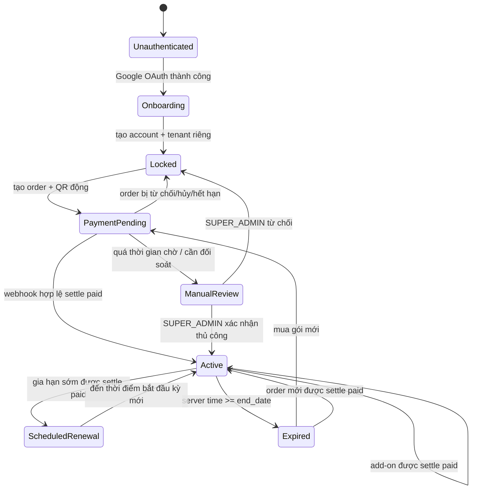

# BẢN THIẾT KẾ THƯƠNG MẠI HÓA SAAS SELF-SERVICE V1

Ngày thiết kế: 15/07/2026
Trạng thái: Chốt kiến trúc, chưa triển khai code/database
Production hiện tại: `https://picvn.vercel.app`

## 1. Mục tiêu

Cho phép khách hàng tự đăng nhập bằng Google, tự tạo không gian dữ liệu riêng,
mua quyền sử dụng theo thời hạn và chỉ được vận hành giải khi thanh toán đã được
backend xác thực tự động hoặc được SUPER_ADMIN đối soát thủ công theo luồng dự
phòng.

Thiết kế phải bảo đảm:

- mỗi khách hàng được cách ly bằng tenant riêng;
- đăng nhập được không đồng nghĩa với có quyền nghiệp vụ;
- menu và backend cùng dùng một trạng thái quyền hiệu lực;
- thời hạn, quota và thanh toán do backend quyết định;
- hết hạn không xóa dữ liệu và không khóa Supabase Auth;
- không tạo một hệ subscription/quota song song với Phase 5.

## 2. Quyết định nghiệp vụ đã chốt

| Nội dung | Quyết định |
|---|---|
| Tenant | Mỗi khách hàng Google có một tenant riêng |
| Loại tenant | `self_service_customer` |
| Role hồ sơ | `EVENT_ADMIN` |
| Quyền sau Google login | Chưa có hiệu lực nghiệp vụ |
| Giao diện khi chưa mở khóa/hết hạn | Chỉ menu Mở khóa, hồ sơ và Đăng xuất |
| Số giải active | 1 |
| Số nội dung active mặc định | 3 |
| Số REFEREE active mặc định | 1 |
| Archived | Không chiếm quota, dữ liệu vẫn được lưu |
| Quota mua thêm | Chỉ có hiệu lực trong kỳ subscription hiện tại |
| Xác nhận thanh toán mặc định | Tự động qua webhook có chữ ký hợp lệ từ payOS/nhà cung cấp |
| Xác nhận thủ công | Chỉ là fallback và chỉ SUPER_ADMIN được thực hiện |
| Nút sau thời gian chờ | “Yêu cầu kiểm tra thanh toán”, chỉ chuyển order sang `manual_review` |
| Thời điểm bắt đầu | Lúc backend settle order thành `paid` |
| Hết hạn | Khóa quyền ứng dụng, không khóa Google/Supabase Auth |

## 3. Bảng giá V1

| Mã gói | Thời hạn | Giá | Giải active | Nội dung active | REFEREE active |
|---|---:|---:|---:|---:|---:|
| `SELF_3D` | 3 ngày | 20.000 VND | 1 | 3 | 1 |
| `SELF_7D` | 7 ngày | 50.000 VND | 1 | 3 | 1 |
| `SELF_30D` | 30 ngày | 100.000 VND | 1 | 3 | 1 |
| `SELF_60D` | 60 ngày | 200.000 VND | 1 | 3 | 1 |

Add-on:

- thêm 1 nội dung active: 10.000 VND;
- thêm 1 REFEREE active: 10.000 VND.

Tổng tiền order:

```text
total_amount = plan_price
             + extra_event_quantity * 10.000
             + extra_referee_quantity * 10.000
```

Giá, thời hạn và quota phải được chụp snapshot vào order/subscription. Việc sửa
bảng giá sau này không được làm thay đổi kỳ đã mua.

## 4. Luồng tổng thể



### 4.1 Google onboarding

1. Frontend gọi Supabase Google OAuth.
2. Sau callback, frontend gửi access token đến Vercel API canonical.
3. Backend xác minh token và chạy bootstrap idempotent.
4. Nếu lần đầu đăng nhập:
   - tạo tenant riêng;
   - tạo account liên kết `auth.users.id`;
   - gán role hồ sơ `EVENT_ADMIN`;
   - tạo customer profile trạng thái `pending_subscription`;
   - chưa tạo subscription active.
5. Nếu đã tồn tại, trả lại đúng tenant/account cũ; không tạo trùng.
6. Route guard đưa khách tới `/unlock`.

Tenant slug không dùng email hay tên Google trực tiếp. Dạng đề xuất:
`kh-<random-short-id>` để tránh lộ thông tin và trùng slug.

### 4.2 Ý nghĩa role và quyền hiệu lực

```text
effective_access = authenticated
                AND account active/not deleted/not banned
                AND tenant active/not deleted
                AND role/action policy hợp lệ
                AND subscription active trong server time
                AND đúng tenant/scope
                AND chưa vượt quota đối với thao tác tạo mới
```

Account có role `EVENT_ADMIN` chỉ là hồ sơ chức vụ. Khi subscription inactive,
mọi quyền nghiệp vụ của role này phải trả về false. Không dựa vào việc ẩn menu.

Không dùng `accounts.status = pending_subscription`, vì account phải active để
đăng nhập và mở trang thanh toán. Trạng thái onboarding nằm trong customer
profile; trạng thái quyền nằm trong subscription/effective access.

## 5. Tận dụng schema SaaS hiện có

Các thành phần Phase 5 tiếp tục là canonical:

- `subscription_plans`;
- `tenant_subscriptions`;
- `tenant_usage`;
- `get_tenant_entitlements_v1`;
- `ensure_tenant_quota_v1`;
- effective access, workspace guard và audit hiện có.

Không tạo một bảng plan/subscription mới chạy song song. Chỉ mở rộng hợp đồng
hiện tại để hỗ trợ duration-based self-service và quota riêng.

## 6. Mô hình dữ liệu đề xuất

### 6.1 Mở rộng `tenants`

```text
tenant_type        text not null default 'managed_enterprise'
```

Giá trị V1:

- `managed_enterprise`: tenant hiện tại do quản trị tạo;
- `self_service_customer`: tenant tự tạo qua Google.

Subscription guard bắt buộc nghiêm cho `self_service_customer`. Tenant cũ không
được thay đổi hành vi trong migration đầu.

### 6.2 `self_service_customer_profiles` mới

```text
id                  uuid primary key
account_id          uuid unique not null -> accounts.id
tenant_id           uuid unique not null -> tenants.id
onboarding_status   text not null
terms_accepted_at   timestamptz null
created_at          timestamptz not null
updated_at          timestamptz not null
```

Trạng thái onboarding: `pending_subscription`, `ready`, `suspended`. Không lưu
`active/expired` ở đây vì đó là trạng thái suy ra từ subscription; tránh hai
source of truth bị lệch. Không sao chép password/token hoặc dữ liệu OAuth nhạy
cảm sang bảng này.

### 6.3 Mở rộng `subscription_plans`

```text
code                    text unique
billing_model           text             -- recurring | duration
duration_days           integer null
price_vnd               numeric(12,0) null
max_active_tournaments  integer not null default 1
max_active_referees     integer not null default 1
```

`max_events` hiện có tiếp tục là giới hạn nội dung. Với gói self-service,
`max_users` tối thiểu bằng 2 để gồm customer owner và một REFEREE, nhưng quota
REFEREE vẫn được kiểm tra riêng để không nhầm owner với trọng tài.

### 6.4 Mở rộng `tenant_subscriptions`

Giữ bảng này là source of truth cho kỳ sử dụng. Bổ sung:

```text
activated_at        timestamptz null
activation_order_id uuid null
confirmed_by        uuid null -> accounts.id
```

Trạng thái: `scheduled`, `active`, `expired`, `cancelled`, `suspended`.

- Kỳ mới khi tenant đã hết hạn: bắt đầu tại thời điểm settlement thành công.
- Gia hạn sớm: tạo kỳ `scheduled`, bắt đầu tại `current.end_date`.
- Tại ranh giới kỳ, backend chuyển kỳ cũ sang `expired`, kỳ mới sang `active`
  trong cùng transaction.
- Mọi guard vẫn so sánh `start_date/end_date` với `now()`; không phụ thuộc cron.

### 6.5 `subscription_entitlements` mới

Lưu snapshot quota của từng kỳ:

```text
id               uuid primary key
subscription_id  uuid not null -> tenant_subscriptions.id
resource_type    text not null  -- tournaments | events | referees
base_limit       integer not null
addon_limit      integer not null default 0
created_at       timestamptz not null
updated_at       timestamptz not null
unique(subscription_id, resource_type)
```

`effective_limit = base_limit + addon_limit`.

### 6.6 `payment_orders` mới

```text
id                         uuid primary key
order_code                 text unique not null
tenant_id                  uuid not null
account_id                 uuid not null
order_type                 text not null  -- activation | renewal | addon
plan_id                    uuid null
status                     text not null
currency                   text not null default 'VND'
base_amount                 numeric(12,0) not null
addon_amount                numeric(12,0) not null default 0
total_amount                numeric(12,0) not null
duration_days_snapshot      integer null
transfer_content            text unique not null
payment_provider            text not null default 'payos'
provider_order_code         bigint null
provider_order_id           text null
provider_transaction_id     text null
provider_checkout_url       text null
provider_qr_code            text null
paid_amount                 numeric(12,0) null
paid_at                     timestamptz null
settlement_source           text null  -- webhook | manual
webhook_received_at         timestamptz null
manual_review_available_at  timestamptz null
manual_review_requested_at  timestamptz null
confirmed_at                timestamptz null
confirmed_by                uuid null
rejection_reason            text null
expires_at                  timestamptz null
created_at                  timestamptz not null
updated_at                  timestamptz not null
```

Trạng thái order V1 chỉ gồm:

- `awaiting_payment`: đã tạo order/QR, đang chờ webhook;
- `paid`: đã settle thành công, là trạng thái kết thúc và không xử lý lại;
- `manual_review`: khách đã yêu cầu đối soát hoặc backend chuyển sang xử lý tay;
- `payment_mismatch`: webhook hợp lệ nhưng số tiền/nội dung không khớp;
- `webhook_invalid`: giao dịch có thể liên kết an toàn nhưng payload không đạt
  kiểm tra nghiệp vụ;
- `rejected`: SUPER_ADMIN đã đối soát và từ chối;
- `expired`: hết thời hạn thanh toán;
- `cancelled`: order bị khách hoặc hệ thống hủy trước khi paid.

Chuyển trạng thái hợp lệ:

| Từ | Tác nhân/sự kiện | Đến |
|---|---|---|
| `awaiting_payment` | Webhook hợp lệ, đúng tiền, settlement thành công | `paid` |
| `awaiting_payment` | Webhook hợp lệ nhưng sai tiền | `payment_mismatch` |
| `awaiting_payment` | Webhook đã liên kết an toàn nhưng sai ngữ nghĩa khác | `webhook_invalid` |
| `awaiting_payment`, `payment_mismatch`, `webhook_invalid` | Yêu cầu đối soát hợp lệ sau timeout | `manual_review` |
| `manual_review` | SUPER_ADMIN confirm và settlement thành công | `paid` |
| `manual_review` | SUPER_ADMIN từ chối | `rejected` |
| Trạng thái chưa paid hợp lệ | Quá `expires_at` | `expired` |
| `awaiting_payment` | Khách/hệ thống hủy hợp lệ | `cancelled` |
| `paid` | Webhook/manual request lặp | Giữ `paid`, trả idempotent |

Webhook sai chữ ký không nằm trong bảng chuyển trạng thái vì payload đó không
được phép tác động đến order.

`provider_transaction_id` phải unique khi có giá trị để một giao dịch ngân hàng
không thể thanh toán hai order. `paid` là terminal: mọi webhook hoặc manual
confirm đến sau chỉ trả kết quả idempotent, không tạo lại invoice/subscription và
không cộng lại quota. `provider_order_code` cũng phải unique khi có giá trị.
`order_code` dạng `PIC-XXXXXXXX` dùng để hiển thị/nội dung chuyển khoản; không
đồng nhất nó với `orderCode` dạng số của payOS.

### 6.7 `payment_order_items` mới

```text
id          uuid primary key
order_id    uuid not null -> payment_orders.id
item_type   text not null  -- plan | event_addon | referee_addon
description text not null
quantity    integer not null
unit_price  numeric(12,0) not null
amount      numeric(12,0) not null
metadata    jsonb not null default '{}'
```

Database kiểm tra `amount = quantity * unit_price` và tổng items bằng
`payment_orders.total_amount`. Frontend không được gửi giá tùy ý; backend đọc
catalog giá và tự tính.

### 6.8 `payment_webhook_events` mới

Lưu lần nhận webhook để xác minh chữ ký, chống phát lại và phục vụ đối soát:

```text
id                    uuid primary key
provider              text not null
provider_event_id     text not null
payload_hash          text not null
signature_valid       boolean not null
order_id              uuid null -> payment_orders.id
processing_status     text not null
error_code            text null
sanitized_payload     jsonb not null default '{}'
received_at           timestamptz not null
processed_at          timestamptz null
unique(provider, provider_event_id)
```

`provider_event_id` là idempotency key đã chuẩn hóa từ transaction `reference`
được xác minh của payOS (hoặc khóa sự kiện chính thức của provider khác), không
giả định payload luôn có trường tên `event_id`.

Không lưu secret, chữ ký thô, access token hoặc dữ liệu ngân hàng không cần thiết.
Webhook sai chữ ký là dữ liệu không đáng tin: chỉ ghi security event và trả mã
phù hợp, không được lấy `order_code` do payload giả mạo cung cấp để đổi order sang
`webhook_invalid`. Trạng thái `webhook_invalid` chỉ được gán khi backend đã liên
kết order bằng dữ liệu provider đáng tin nhưng kiểm tra ngữ nghĩa tiếp theo thất
bại.

### 6.9 Dùng lại `invoices`

Order chưa `paid` không phải invoice paid. Khi settlement tự động hoặc thủ công
thành công:

- order chuyển `paid`;
- tạo/cập nhật `invoices` với `paid_at`;
- kích hoạt subscription hoặc cộng add-on;
- ghi audit trong cùng transaction.

### 6.10 Payment receiving profile

Thông tin V1 được hiển thị:

- Ngân hàng: BIDV;
- Số tài khoản: `8895707574`;
- Tên: `Nguyen Van Huu`;
- QR động: backend tạo qua payOS/VietQR theo đúng order code và số tiền;
- QR BIDV tĩnh: asset do chủ dự án cung cấp, chỉ dùng làm fallback khi provider
  không tạo được payment link/QR động.

Thông tin nhận tiền là dữ liệu công khai có chủ đích, nhưng nên đọc qua một
safe config/RPC để có thể thay đổi mà không sửa bundle. Không lưu thông tin đăng
nhập ngân hàng, API key hoặc secret. VietQR/ảnh QR chỉ giúp tạo lệnh chuyển tiền,
không phải bằng chứng đã thanh toán. Chỉ webhook provider đã xác minh hoặc manual
confirmation của SUPER_ADMIN mới được settle order.

## 7. Luồng thanh toán hai lớp

### 7.1 Tạo order

1. Khách chọn gói.
2. Chọn số nội dung và REFEREE mua thêm bằng stepper.
3. Backend lấy giá canonical, tính tổng, tạo mã hiển thị `PIC-XXXXXXXX` và
   `provider_order_code` dạng số duy nhất.
4. Backend gọi payOS để tạo payment link/QR động với chính xác provider order
   code, mô tả chuyển khoản và số tiền; secret provider chỉ nằm ở Vercel server.
5. UI hiển thị QR, số tiền, tài khoản nhận và nội dung chuyển khoản.
6. Order bắt đầu ở `awaiting_payment` và frontend chỉ polling/refetch trạng thái.
7. Order có thời hạn thanh toán, đề xuất 24 giờ.

Nếu payOS tạm lỗi, UI có thể hiển thị QR BIDV tĩnh. Order vẫn là
`awaiting_payment`; thanh toán fallback không được frontend tự xác nhận và có thể
cần chuyển sang `manual_review` để đối soát.

### 7.2 Luồng chính: webhook tự động

1. payOS/provider gửi webhook tới endpoint public riêng.
2. Backend xác minh chữ ký/checksum bằng secret server-side trước khi tin bất kỳ
   trường nào trong payload.
3. Ghi `payment_webhook_events` theo `provider_event_id` unique.
4. Liên kết đúng order qua provider reference/order code đáng tin.
5. Kiểm tra provider status, currency, số tiền, tenant, account, order type,
   order items, thời hạn và trạng thái order.
6. Gọi chung một settlement transaction với manual confirmation.
7. Transaction lock order, chuyển `paid`, tạo invoice, kích hoạt/gia hạn/cộng
   add-on và ghi audit nguyên tử.
8. UI refetch thấy `paid` rồi mới mở quyền nghiệp vụ.

Webhook hợp lệ nhưng sai số tiền chuyển order sang `payment_mismatch`, không kích
hoạt. Webhook gửi lặp hoặc đến sau khi order đã `paid` phải được ACK thành công và
ghi nhận là duplicate/already-paid, không xử lý nghiệp vụ lần hai.

### 7.3 Luồng dự phòng: yêu cầu kiểm tra thanh toán

Nút **Yêu cầu kiểm tra thanh toán** chỉ xuất hiện sau thời gian chờ cấu hình,
đề xuất 5 phút kể từ lúc tạo order. Nút này thay hoàn toàn nút **Tôi đã chuyển
khoản** và chỉ thực hiện:

```text
awaiting_payment | payment_mismatch | webhook_invalid -> manual_review
```

Khách không thể tự ghi `paid`, kích hoạt subscription, cộng quota, tạo invoice,
ghi `confirmed_by` hoặc thay đổi thời hạn. Bấm nút chỉ tạo yêu cầu đối soát và ghi
audit; tài khoản vẫn ở màn Mở khóa.

### 7.4 SUPER_ADMIN xác nhận thủ công

Backend manual confirmation phải:

1. xác thực actor là SUPER_ADMIN đang active;
2. nhận order id, không tin tenant/account/amount do frontend tự quyết định;
3. lock order trong transaction;
4. chỉ cho settle khi trạng thái là `manual_review`; nếu đang
   `payment_mismatch`/`webhook_invalid`, order phải được đưa vào manual review
   trước; nếu đã `paid` thì chỉ trả kết quả idempotent;
5. tải lại order, items, expected amount, tenant và account từ database;
6. kiểm tra tenant/account còn hợp lệ, order chưa expired/cancelled/rejected và
   giao dịch/reference chưa dùng cho order khác;
7. yêu cầu số tiền thực nhận bằng đúng `total_amount`, mã giao dịch/reference và
   ghi chú đối soát hợp lệ; nếu lệch tiền thì giữ `payment_mismatch` hoặc từ chối,
   tuyệt đối không kích hoạt;
8. gọi cùng settlement transaction của webhook;
9. ghi actor, target tenant/account, expected/received amount, order, kết quả và
   settlement source vào audit, không ghi secret;
10. trả kết quả idempotent nếu order đã `paid` trước đó.

Không role nào khác được gọi manual-confirm API. Customer chỉ được gọi API yêu
cầu `manual_review` cho order thuộc chính account/tenant của mình. SUPER_ADMIN có
thể đưa một order mismatch/invalid đã liên kết an toàn vào `manual_review` để đối
soát, nhưng thao tác đó chưa được kích hoạt subscription.

### 7.5 Idempotency và xử lý đồng thời

Webhook và manual confirmation phải đi qua một hàm nội bộ duy nhất, ví dụ
`settle_payment_order_v1`, chạy trong một database transaction:

```text
BEGIN
SELECT payment_order FOR UPDATE
IF status = paid: return already_paid
validate order + amount + tenant + account + provider transaction
upsert invoice by unique order_id
activate subscription/add-on by unique activation_order_id
set order = paid
write audit
COMMIT
```

Unique constraints trên `provider_transaction_id`, `invoice.order_id` và
`activation_order_id` là lớp bảo vệ thứ hai. Nếu admin đang confirm và webhook
đến đồng thời, request lấy lock sau phải đọc lại `paid` và thoát idempotent. Không
được có đường code riêng để mỗi luồng tự cộng quota.

## 8. Quy tắc quota

Usage V1 cần bổ sung:

```text
tournaments_used = tournament chưa deleted/archived và status active
events_used       = event chưa deleted/archived và status active
referees_used     = account role REFEREE, status active, deleted_at null
```

Quy tắc:

- owner `EVENT_ADMIN` không tính vào `referees_used`;
- archived trả lại quota active;
- restore phải kiểm tra quota trước khi khôi phục;
- add-on chỉ tăng entitlement của subscription hiện tại;
- kỳ gia hạn mới trở về quota cơ bản cộng add-on mua trong order gia hạn;
- không tự xóa/archive dữ liệu khi hết hạn hoặc giảm quota;
- nếu kỳ mới có limit thấp hơn usage hiện có, khóa thao tác tạo mới nhưng vẫn
  giữ dữ liệu; admin phải archive bớt để trở lại giới hạn.

Quota được kiểm tra bằng transaction lock như Phase 5 để chống hai request đồng
thời cùng vượt giới hạn.

`tenant_usage`, `get_tenant_entitlements_v1` và `ensure_tenant_quota_v1` phải
được mở rộng để lấy effective limit từ `subscription_entitlements` đối với
self-service tenant; không để trigger cũ tiếp tục chỉ đọc giới hạn plan cơ bản.

## 9. Subscription guard

### 9.1 RPC trạng thái duy nhất

Đề xuất `get_commercial_access_state_v1()` trả:

```text
account
tenant
customer_status
subscription_status
start_date/end_date/server_now
plan
entitlements
usage/remaining
ui_mode = unlock_only | active | suspended
allowed_actions
pending_order
```

Frontend không tự tính hết hạn bằng đồng hồ máy khách.

### 9.2 Guard backend

Đề xuất internal function `ensure_commercial_access_v1(tenant, action,
resource, delta)` và tích hợp vào policy tập trung hiện có.

Với self-service tenant, mọi thao tác nghiệp vụ đều phải kiểm tra subscription,
không chỉ thao tác tạo mới:

- tạo/sửa/xóa giải;
- tạo/sửa/xóa nội dung;
- đội, bảng, lịch;
- nhập/reset/chốt điểm;
- xếp hạng, knockout;
- tạo/xóa/gán REFEREE;
- quản lý quyền;
- trình chiếu quản trị.

Các API billing cần thiết để gia hạn vẫn được phép khi `unlock_only`.

SUPER_ADMIN có thể hỗ trợ tenant hết hạn theo policy support riêng, nhưng mọi
bypass phải ghi audit. Không cấp bypass cho customer `EVENT_ADMIN`.

### 9.3 Quyền tạo giải của EVENT_ADMIN self-service

Không nâng toàn bộ `EVENT_ADMIN` thành `TENANT_ADMIN`. Chỉ thêm policy rõ ràng:

```text
can_create_tournament = tenant_type self_service_customer
                     AND account là owner của tenant
                     AND subscription active
                     AND active_tournaments < tournament_limit
```

Nhờ đó EVENT_ADMIN cũ không tự nhiên được tạo giải ngoài phạm vi hiện tại.

## 10. Route và menu

### Chưa mở khóa / pending / expired

Hiển thị duy nhất:

- **Mở khóa/Gia hạn**;
- họ tên, email Google an toàn;
- trạng thái đơn hàng;
- đăng xuất.

Ẩn menu workspace và redirect mọi URL `/admin/workspace/:slug` về `/unlock`.
Route guard chỉ là UX; backend vẫn phải từ chối RPC trực tiếp.

### Active

Hiển thị menu theo cây quyền `EVENT_ADMIN` hiện có và thêm khu **Gói dịch vụ**
để xem ngày hết hạn, usage và mua add-on/gia hạn.

### Khi vừa hết hạn trong một session đang mở

- backend chặn request kế tiếp ngay theo `now()`;
- UI refetch access state định kỳ và khi tab focus;
- xóa cache dữ liệu quản trị;
- redirect `/unlock`;
- REFEREE thuộc tenant cũng bị chặn nhập điểm.

Dữ liệu cũ không bị xóa. Public tournament link tiếp tục là read-only trong V1;
subscription chỉ khóa quyền quản trị và cập nhật. Chính sách khóa public link có
thể bổ sung sau bằng feature flag riêng, không trộn vào activation V1.

## 11. UI Mở khóa V1

Màn hình tham khảo giao diện đã cung cấp nhưng dùng bố cục phù hợp PIC_HUU:

1. Header “Mở khóa vận hành giải đấu”.
2. Bốn lựa chọn thời hạn dạng segmented control/cards gọn.
3. Hai stepper:
   - số nội dung mua thêm;
   - số REFEREE mua thêm.
4. Bảng tóm tắt quota và tổng tiền.
5. QR BIDV đủ lớn để quét trên desktop/mobile.
6. Thông tin tài khoản, số tiền và nội dung chuyển khoản có nút copy.
7. Trạng thái “Đang chờ xác nhận tự động” và thời gian đã chờ.
8. Nút **Yêu cầu kiểm tra thanh toán** chỉ xuất hiện sau
   `manual_review_available_at`; không có nút tự kích hoạt.
9. Trạng thái manual review, sai số tiền, từ chối, hết hạn phải có thông báo rõ
   nhưng không làm lộ dữ liệu giao dịch nội bộ.

Không cho nhập mã giảm giá trong V1 vì chưa có chính sách coupon canonical.

## 12. Backend canonical

- Supabase Auth: Google identity/session.
- Vercel API: onboarding, tạo order payOS, webhook và manual confirmation
  canonical.
- Supabase PostgreSQL/RPC: tenant isolation, entitlement, quota, policy, audit.
- Service role chỉ tồn tại ở Vercel server; không dùng biến `VITE_`.
- payOS client API key/checksum key/webhook secret chỉ tồn tại trong Vercel
  Environment Variables server-side; frontend chỉ nhận checkout URL/QR an toàn.
- Frontend không ghi trực tiếp payment/subscription/entitlement tables.
- Supabase Edge Functions không được tạo logic payment/account song song.

API dự kiến:

```text
POST /api/commercial/bootstrap
GET  /api/commercial/access-state
GET  /api/commercial/plans
POST /api/commercial/orders
GET  /api/commercial/orders/current
POST /api/commercial/orders/:id/manual-review
POST /api/webhooks/payos
GET  /api/admin/commercial/orders
POST /api/admin/commercial/orders/:id/manual-review
POST /api/admin/commercial/orders/:id/confirm
POST /api/admin/commercial/orders/:id/reject
```

`POST /api/webhooks/payos` không yêu cầu user session nhưng bắt buộc xác minh chữ
ký/checksum, chống replay, giới hạn kích thước payload và rate limit. Endpoint
manual confirm bắt buộc Supabase session hợp lệ và policy SUPER_ADMIN ở backend.

Tham chiếu contract khi triển khai:

- [payOS Payment Webhook API](https://payos.vn/docs/du-lieu-tra-ve/webhook/);
- [payOS kiểm tra dữ liệu bằng signature](https://payos.vn/docs/tich-hop-webhook/kiem-tra-du-lieu-voi-signature/);
- [payOS Node.js SDK](https://payos.vn/docs/sdks/back-end/node/);
- [payOS môi trường test](https://payos.vn/docs/moi-truong-test/).

payOS hiện không có sandbox riêng. E2E thanh toán phải dùng giao dịch thật giá
trị nhỏ trên môi trường provider chính thức, tenant test riêng và feature flag
rollout; không dùng order của giải production thật để thử.

## 13. Audit bắt buộc

- `GOOGLE_CUSTOMER_BOOTSTRAPPED`;
- `COMMERCIAL_ORDER_CREATED`;
- `PAYMENT_WEBHOOK_RECEIVED`;
- `PAYMENT_WEBHOOK_VERIFIED` / `PAYMENT_WEBHOOK_INVALID`;
- `PAYMENT_WEBHOOK_DUPLICATE`;
- `PAYMENT_MISMATCH_DETECTED`;
- `PAYMENT_MANUAL_REVIEW_REQUESTED`;
- `PAYMENT_AUTO_SETTLED`;
- `PAYMENT_MANUAL_CONFIRMED` / `PAYMENT_MANUAL_REJECTED`;
- `SUBSCRIPTION_ACTIVATED` / `SUBSCRIPTION_EXPIRED`;
- `SUBSCRIPTION_RENEWAL_SCHEDULED`;
- `ENTITLEMENT_ADDON_GRANTED`;
- `COMMERCIAL_ACCESS_DENIED`;
- `QUOTA_EXCEEDED`.

Audit payment tối thiểu có actor type (`provider`, `customer`, `SUPER_ADMIN`),
actor id khi có, order id, tenant id, account id, expected/received amount,
provider event/transaction reference đã rút gọn, settlement source, kết quả và
error code an toàn. Audit không ghi access token, refresh token, password, ảnh
chứng từ chứa dữ liệu nhạy cảm, webhook secret hoặc secret ngân hàng.

## 14. Test matrix bắt buộc

| Nhóm | Test |
|---|---|
| Google | Login lần đầu tạo đúng 1 auth mapping/account/tenant |
| Google | Login lại không tạo tenant/account trùng |
| Isolation | Hai Google user không đọc/ghi chéo tenant |
| Locked | Chưa trả tiền chỉ thấy `/unlock` |
| Locked | Direct workspace URL bị redirect |
| Locked | Gọi RPC nghiệp vụ trực tiếp bị chặn |
| Order | Backend tính đúng bốn giá gói |
| Order | Add-on tính đúng 10.000 VND/đơn vị |
| Order | Customer không sửa giá/tổng tiền |
| Payment | Webhook có chữ ký, order và số tiền hợp lệ tự kích hoạt |
| Payment | Webhook gửi lặp không tạo invoice/subscription hoặc cộng quota hai lần |
| Payment | Khách yêu cầu manual review không tự mở khóa |
| Payment | Nút manual review chưa hết thời gian chờ bị backend chặn |
| Payment | SUPER_ADMIN manual confirm mở khóa đúng order |
| Payment | Webhook đến sau manual confirm chỉ ACK, không kích hoạt lại |
| Payment | Manual confirm và webhook đồng thời chỉ có một settlement thắng |
| Payment | Sai số tiền chuyển `payment_mismatch`, không kích hoạt và có thể vào manual review |
| Payment | Customer/role khác không gọi được API manual confirm |
| Payment | Webhook sai chữ ký không thay đổi order theo payload không đáng tin |
| Payment | Một provider transaction không dùng được cho hai order |
| Activation | `start_date` là server settlement time |
| Activation | `end_date` đúng 3/7/30/60 ngày |
| Quota | Chặn giải active thứ hai |
| Quota | Chặn nội dung thứ tư ở gói cơ bản |
| Quota | Chặn REFEREE thứ hai ở gói cơ bản |
| Quota | Hai request đồng thời không vượt quota |
| Archived | Archive trả quota; restore vượt quota bị chặn |
| Add-on | Confirm add-on tăng đúng quota, không đổi end_date |
| Expiry | Session đang mở bị chặn mọi mutation ngay khi hết hạn |
| Expiry | REFEREE hết subscription không nhập điểm được |
| Renewal | Gia hạn sớm tạo kỳ scheduled, không mất ngày còn lại |
| Renewal | Kỳ mới reset đúng quota và add-on của kỳ mới |
| Data | Hết hạn không xóa giải/nội dung/kết quả |
| Public | Public tournament read-only vẫn hoạt động |
| Security | Không lộ service role/token/secret |
| Audit | Auto/manual đều có actor/order/account/tenant/amount/source/result, không có secret |
| Regression | Tenant production cũ không đổi hành vi |

PASS chỉ được ghi khi API/RPC thành công hoặc bị chặn đúng, DB thay đổi đúng,
UI cập nhật đúng và reload vẫn đúng.

## 15. Lộ trình PR nhỏ

1. **PR-COM-01 – Google OAuth & idempotent onboarding**
   Chưa mở quyền nghiệp vụ; test tenant isolation.
2. **PR-COM-02 – Plan/order/entitlement schema**
   Chỉ migration + RPC/read contract; chưa có activation UI.
3. **PR-COM-03 – payOS order & signed webhook**
   QR động, webhook event ledger, signature verification và auto settlement.
4. **PR-COM-04 – Manual review fallback**
   Customer request sau timeout, SUPER_ADMIN confirm/reject, dùng chung atomic
   settlement và audit với webhook.
5. **PR-COM-05 – Subscription guard toàn nghiệp vụ**
   Tích hợp vào policy tập trung; test expiry/revocation.
6. **PR-COM-06 – Unlock-only route/menu**
   Google callback, plan UI, quota stepper, QR và trạng thái order.
7. **PR-COM-07 – Add-on & renewal**
   Scheduled renewal, period-scoped quota.
8. **PR-COM-08 – Production E2E & rollout**
   Test Google thật, giao dịch payOS thật giá trị nhỏ trên tenant test, manual
   fallback, concurrency, rollback và runbook đối soát.

Mỗi PR đi qua branch riêng, Draft PR, Vercel Preview và chỉ merge khi checklist
phạm vi đó PASS.

## 16. Rollback

- Google provider có thể tắt mà không ảnh hưởng tài khoản username/password cũ.
- Tenant onboarding lỗi phải rollback account/tenant trong một transaction.
- Order/payment tables chỉ bổ sung, không thay dữ liệu giải hiện tại.
- Subscription guard phải có feature flag theo `tenant_type`; rollback bằng cách
  tắt self-service enforcement, không sửa tenant enterprise cũ.
- Settlement payment lỗi phải rollback order paid, invoice, subscription và
  entitlement cùng transaction.
- Có thể tắt webhook auto settlement bằng server feature flag và chuyển order mới
  sang manual review; không được xóa webhook event ledger hoặc tự coi order paid.
- Không hard-delete order/invoice/audit đã xác nhận.

## 17. Việc không được làm

- Không dùng tenant chung `khach-hang`.
- Không khóa/xóa `auth.users` khi subscription hết hạn.
- Không kích hoạt bằng nút frontend.
- Không coi QR VietQR hoặc ảnh biên lai do khách cung cấp là xác nhận tự động.
- Không có hai implementation riêng để webhook và manual confirm tự cộng quota.
- Không tin giá, quota, tenant_id hoặc role do frontend truyền.
- Không chỉ ẩn menu mà bỏ qua backend guard.
- Không dùng direct frontend DB write cho billing/subscription.
- Không đưa service role hoặc secret ngân hàng vào frontend.
- Không reset dữ liệu production để triển khai thương mại hóa.
- Không triển khai tất cả trong một PR lớn.

## 18. Tiêu chí chấp nhận kiến trúc

Thiết kế V1 được coi là chốt khi chủ dự án đồng ý:

1. account vẫn active để login; onboarding/subscription mới là khóa nghiệp vụ;
2. mỗi customer có tenant riêng;
3. một kỳ gồm 1 giải, 3 nội dung, 1 REFEREE active;
4. archived trả quota active;
5. add-on chỉ thuộc kỳ hiện tại;
6. webhook có chữ ký hợp lệ là luồng kích hoạt mặc định; manual confirmation chỉ
   là fallback của SUPER_ADMIN;
7. public tournament giữ read-only khi admin hết hạn;
8. mọi settlement idempotent và được serialize bằng transaction/row lock;
9. triển khai theo tám PR nhỏ ở trên.
