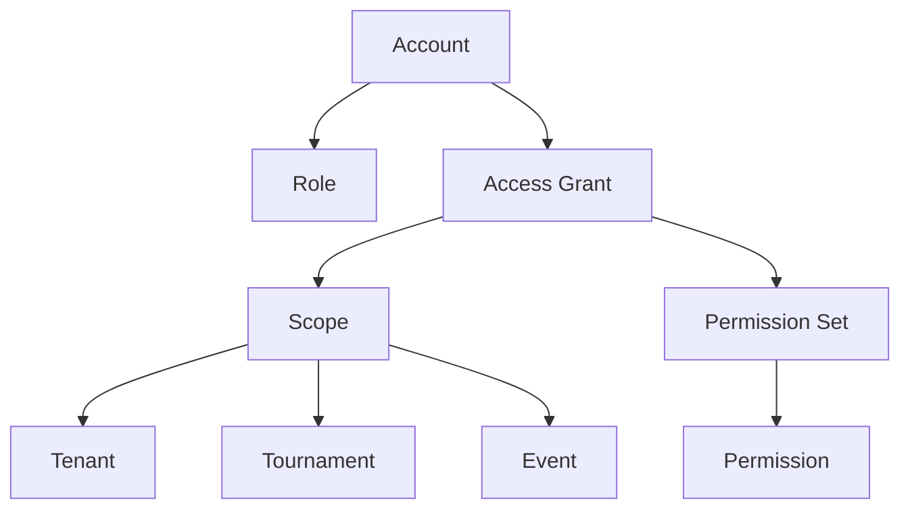
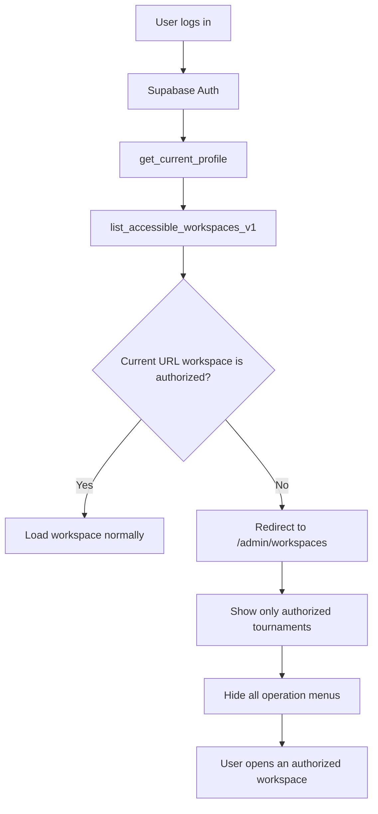

# Workspace Access & Permission Architecture Roadmap

Date: 2026-07-04

Project: PIC_HUU / Tournament Manager Enterprise

## 1. Executive Summary

Current business need:

- Every non-SUPER_ADMIN account must enter only the tournaments/workspaces it is authorized to access.
- If a user logs in from a wrong tournament URL, the system must not leave them confused inside an unauthorized workspace.
- The user should be redirected to a clear "Authorized tournaments" page and all unrelated operation menus should be hidden.
- REFEREE accounts must also be able to see the authorized tournament list, but without management features outside their role.

Recommended direction:

Build a centralized access model:

1. Identity: who the account is.
2. Access Scope: which tenant/tournament/event the account may access.
3. Permission: which actions the account may perform inside that scope.

This is the correct direction for an enterprise SaaS architecture. It avoids hard-coded role checks in UI components and supports future expansion to multiple sports, multiple tenants, multiple tournaments, and detailed delegated permissions.

## 2. Current State Assessment

The project already has several correct foundations:

- Enterprise accounts and roles exist: SUPER_ADMIN, TENANT_ADMIN, EVENT_ADMIN, REFEREE, VIEWER.
- Event-scoped permissions are stored through `account_event_permissions`.
- Route `/admin/workspaces` already exists as a workspace/tournament directory.
- RPC `list_accessible_workspaces_v1` already exists and should be treated as the authoritative source for accessible tournaments.
- Business RPCs already enforce important permissions on the backend.

Main weakness:

- The login and route flow is not yet fully centralized around accessible workspaces.
- A user can open an unauthorized workspace URL and the UI may still load a confusing context before redirecting or blocking.
- REFEREE-like users do not have a clean "choose the tournament you are assigned to" experience.
- Permission visibility and route access are still partly distributed across React components.

Conclusion:

The current architecture is usable, but the access entry flow must be standardized before the system can scale cleanly.

## 3. Enterprise Architecture Target

The target model should be:



Core objects:

| Object | Responsibility |
|---|---|
| Account | Represents a real login identity. |
| Role | Defines default capability level. |
| Tenant | Business owner/unit. |
| Tournament | Competition workspace. |
| Event | Competition category/content inside a tournament. |
| AccessGrant | Links an account to a scope and permissions. |
| Permission | Defines allowed actions. |
| AccessPolicy | Decides whether the account may enter a workspace. |

## 4. Recommended Login and Route Flow

For all accounts from TENANT_ADMIN downward:



SUPER_ADMIN exception:

- SUPER_ADMIN may access all workspaces.
- SUPER_ADMIN should not be forced into the restricted authorized workspace flow.

Important UX rule:

- If a user logs in from a wrong workspace URL, do not silently auto-jump to another tournament.
- Redirect to the authorized tournament list and show a short explanation.
- This makes the system understandable and prevents users from thinking the link is broken.

## 5. Permission Enforcement Model

There must be two layers:

### 5.1 Frontend Access Guard

Purpose:

- Improve UX.
- Hide unavailable menus.
- Redirect unauthorized route access.
- Prevent accidental clicks.

The frontend must not be the final security boundary.

### 5.2 Backend RPC/RLS Enforcement

Purpose:

- Enforce real security.
- Reject unauthorized actions even if the frontend is bypassed.
- Prevent stale sessions from continuing after permissions are revoked.

Every mutation should still validate:

- Current account.
- Current role.
- Current scope.
- Current permission.
- Current object ownership/status.

## 6. Object-Oriented Design Assessment

The proposed flow is compatible with object-oriented design if role and permission logic is not scattered in UI components.

Avoid this pattern:

```ts
if (role === 'REFEREE') {
  // special UI logic
}
```

Prefer this pattern:

```ts
accessPolicy.canAccessWorkspace(user, workspace)
permissionPolicy.canViewMenu(user, menu, context)
permissionPolicy.canExecuteAction(user, action, context)
```

Recommended frontend service layer:

| Module | Responsibility |
|---|---|
| `authSession` | Login, logout, profile refresh. |
| `workspaceAccess` | Resolve authorized workspaces and route decision. |
| `permissionPolicy` | Menu/action visibility checks. |
| `routeGuard` | Prevent unauthorized workspace rendering. |
| `workspaceContext` | Set tenant/tournament/event only after authorization. |

Recommended backend policy layer:

| RPC/Function | Responsibility |
|---|---|
| `get_current_profile` | Return identity and effective permissions. |
| `list_accessible_workspaces_v1` | Return authorized tournament list. |
| `can_access_workspace_v1` | Optional explicit workspace guard. |
| `assert_event_permission_v1` | Enforce event-scoped mutations. |
| `record_login_session_v1` | Audit login/session state. |

## 7. Scalability Analysis

This model can support:

- Many tenants.
- Many tournaments per tenant.
- Many events per tournament.
- Many accounts per tournament.
- Event-level delegated administration.
- Referee-only scoring access.
- Viewer/public-only access.
- Different sports with different event/match/scoring rules.
- Subscription and quota control.
- Audit and compliance.

Expected query pattern:

- Login calls profile once.
- Login or route guard calls accessible workspace list once.
- Workspace load calls context and event data for the selected tournament.
- Mutations validate permissions server-side.

This does not create meaningful load risk if indexed correctly.

Required indexes:

- `accounts(auth_user_id)`
- `accounts(tenant_id, status)`
- `account_event_permissions(account_id, event_id, deleted_at/status)`
- `events(tournament_id, status/deleted_at)`
- `tournament(tenant_id, slug, deleted_at/status)`
- `tenants(slug, deleted_at/status)`

## 8. Expansion Options

### Option A: Keep Current Event Permission Table

Use current `account_event_permissions` as the main access grant table.

Pros:

- Low migration risk.
- Fits current code.
- Faster to implement.

Cons:

- Tournament-level and tenant-level grants may remain split across role/tenant logic.
- More conditional logic may accumulate over time.

Recommended for short term.

### Option B: Introduce General `access_grants`

Create a generalized table:

| Column | Example |
|---|---|
| account_id | user account id |
| scope_type | tenant / tournament / event / match |
| scope_id | target object id |
| permission | enter_scores / manage_events / view_public |
| status | active / revoked / archived |
| starts_at | optional |
| ends_at | optional |

Pros:

- Best long-term enterprise model.
- Supports temporary access, sponsor access, match-level referee assignment, and multi-tenant managers.
- Reduces special-case role logic.

Cons:

- Requires migration planning.
- Requires compatibility layer with existing `account_event_permissions`.

Recommended for medium term after stabilizing current production flow.

### Option C: Hybrid Migration

Keep `account_event_permissions` for current runtime but introduce a backend view:

```sql
effective_access_grants_v1
```

This view normalizes:

- Role permissions.
- Tenant admin access.
- Event admin permissions.
- Referee assignments.
- Viewer access.

Frontend and new RPCs read from the normalized view.

Pros:

- Safer than a full rewrite.
- Provides one access contract.
- Allows gradual migration.

Recommended as the best practical path.

## 9. Recommended Roadmap

### Phase 1: Stabilize Login and Authorized Workspace Flow

Goal:

- Fix the current wrong-URL login problem.

Actions:

- Add centralized post-login workspace resolution.
- Add route guard to `/admin/workspace/:slug`.
- Redirect unauthorized non-SUPER_ADMIN accounts to `/admin/workspaces`.
- Hide all operation menus on the authorized workspace list page.
- Ensure REFEREE can see authorized tournament list.

Acceptance criteria:

- `tt1` logging in from an unauthorized URL is redirected to authorized tournament list.
- `tt1` can open only the assigned tournament.
- Correct URL login continues normally.
- SUPER_ADMIN behavior is unchanged.

### Phase 2: Normalize Menu and Action Permissions

Goal:

- UI visibility and action buttons match effective permissions.

Actions:

- Introduce frontend `permissionPolicy`.
- Replace scattered role checks with named capabilities.
- Ensure menus, tabs, buttons, and forms all read from one permission source.
- Keep backend RPC as final enforcement.

Acceptance criteria:

- Removing a permission hides the matching menu/action after refresh or session invalidation.
- Direct RPC/mutation attempts without permission are blocked.

### Phase 3: Effective Access Contract

Goal:

- Create one backend source for "what this account can access".

Actions:

- Add or standardize `effective_access_grants_v1` view/RPC.
- Make `list_accessible_workspaces_v1` read from this normalized contract.
- Include role, tenant, tournament, event, permission summary, and status.

Acceptance criteria:

- Workspace list can show exactly why the user has access.
- Account management screen can show exactly what each account manages.

### Phase 4: Session and Permission Revocation

Goal:

- Permission changes take effect while the user is logged in.

Actions:

- Keep/reuse live permission validation in RPCs.
- Refresh profile/access grants on focus, route change, and mutation failure.
- If current workspace access is revoked, redirect to authorized workspace list.

Acceptance criteria:

- If TENANT_ADMIN removes access from EVENT_ADMIN/REFEREE in another browser, the affected account cannot continue mutations.
- UI updates without requiring full manual logout.

### Phase 5: Generalized Access Grants

Goal:

- Prepare enterprise expansion beyond current event-level permission model.

Actions:

- Introduce `access_grants` or equivalent normalized model.
- Support scope types: tenant, tournament, event, match, public_dashboard.
- Support time-bound permissions.
- Add audit trail for grant/revoke/update.

Acceptance criteria:

- A user can manage multiple tenants/tournaments/events without duplicated custom logic.
- New sports and new permission scopes can be added without changing the login model.

## 10. Risk Analysis

| Risk | Impact | Mitigation |
|---|---|---|
| Frontend hides menu but backend allows mutation | Security/business bug | Keep RPC permission checks mandatory. |
| Stale local storage keeps old workspace | Wrong data loaded | Set workspace context only after route access is confirmed. |
| REFEREE cannot find assigned tournament | Operational confusion | Always provide authorized tournament list for REFEREE. |
| Role checks duplicated across components | Hard to maintain | Centralize permission policy. |
| Large tournament count slows workspace list | Poor UX | Add indexes, pagination, search, and tenant grouping. |
| Future sports require different rules | Hard-coded Pickleball logic | Keep sport rules in event/tournament config, not role/access flow. |

## 11. Final Recommendation

Use the existing `/admin/workspaces` and `list_accessible_workspaces_v1` as the base.

Do not build a separate special login flow for REFEREE or for account `tt1`.

Implement one centralized enterprise flow:

1. Login.
2. Load profile.
3. Load accessible workspaces.
4. Check current URL.
5. Stay if authorized.
6. Redirect to authorized workspace list if unauthorized.
7. Hide all unrelated menus until a valid workspace is selected.
8. Enforce every mutation through backend RPC permission checks.

This is the most stable short-term fix and the right long-term foundation for enterprise expansion.
