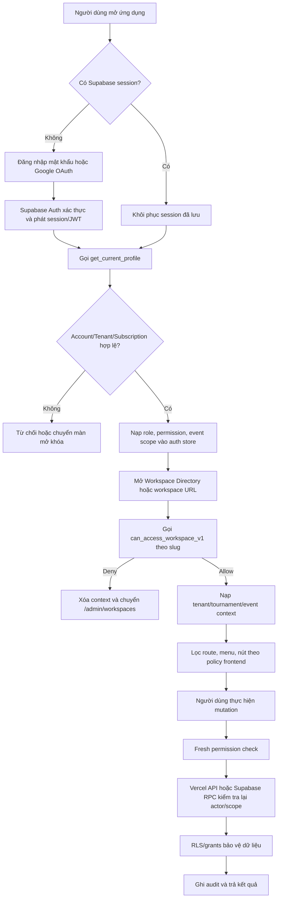

# BÁO CÁO MÔ HÌNH ĐĂNG NHẬP VÀ PHÂN QUYỀN FRONTEND/BACKEND

## 1. Thông tin tài liệu

- Dự án: `PIC_HUU / Tournament Manager Enterprise`
- Phiên bản tài liệu: `V1`
- Phạm vi: đăng nhập, session, workspace access, menu/action permission, Vercel Admin API, Supabase RPC, RLS, database grants và audit.
- Phương pháp: rà soát source code và migration trong repository.
- Không thuộc phạm vi: sửa code, sửa database, apply migration hoặc xác nhận trạng thái schema thực tế trên Supabase Production.

Tài liệu này mô tả kiến trúc đang có trong source và đánh giá khoảng trống. Nó không thay thế một cuộc kiểm tra live database để xác nhận toàn bộ migration, policy và grant đã được áp dụng đúng trên Production.

## 2. Kết luận điều hành

Mô hình hiện tại đã có đúng các lớp chính của một hệ thống SaaS theo phạm vi:

1. Supabase Auth xác thực danh tính và phát hành session/JWT.
2. `get_current_profile` ánh xạ Auth user sang account, tenant, role, subscription và quyền event.
3. Workspace guard gọi `can_access_workspace_v1` trước khi nạp context nghiệp vụ.
4. Frontend dùng role và permission để điều khiển route, menu và nút.
5. Trước mutation event, frontend lấy lại quyền mới nhất qua `assertFreshEventPermission`.
6. Vercel Admin API và Supabase RPC kiểm tra lại actor, tenant, event, permission ở backend.
7. Database grants/RLS giới hạn truy cập trực tiếp; các mutation quan trọng đi qua API/RPC.
8. Audit và cơ chế xóa `active_sessions` hỗ trợ truy vết, thu hồi session.

Nguyên tắc kiến trúc đúng phải được hiểu là:

> Frontend chỉ điều khiển trải nghiệm. Backend và database mới là nguồn quyết định quyền cuối cùng.

Hệ thống chưa nên được tuyên bố “đã hoàn toàn hardened” vì còn một lỗi P0 ở API reset mật khẩu, một số đường ghi dữ liệu trực tiếp/legacy và một số khác biệt giữa quyền hiển thị frontend với quyền chính xác theo event.

## 3. Ranh giới tin cậy

| Lớp | Trách nhiệm | Có được tin dữ liệu từ frontend không? |
|---|---|---|
| Trình duyệt | Nhập thông tin, hiển thị route/menu/nút | Không |
| Supabase Auth | Xác thực mật khẩu/OAuth, phát JWT, refresh session | Chỉ tin JWT do Supabase phát |
| Profile RPC | Xác định account, tenant, role, subscription, event permission | Không tin role/tenant frontend tự gửi |
| Workspace guard RPC | Xác nhận account được vào tournament theo slug | Không tin slug đồng nghĩa với có quyền |
| Vercel Admin API | Quản trị account và Auth Admin | Chỉ tin actor sau khi xác minh Bearer JWT |
| Supabase business RPC | Kiểm tra scope và thực thi nghiệp vụ | Không tin tenant/event ngoài kiểm tra nội bộ |
| PostgreSQL RLS/grants | Phòng thủ dữ liệu cuối cùng | Không phụ thuộc UI |
| Audit | Ghi actor, action, entity, result, reason | Không ghi password/token/secret |

## 4. Công thức quyết định quyền

Một thao tác chỉ được phép khi đồng thời thỏa mãn:

```text
Identity hợp lệ
+ Account đang hoạt động
+ Tenant đang hoạt động
+ Subscription/business access hợp lệ nếu là khách hàng self-service
+ Role phù hợp
+ Scope phù hợp (tenant/tournament/event)
+ Permission phù hợp với action
+ Resource đang ở trạng thái cho phép
= ALLOW
```

Chỉ kiểm tra `role === "EVENT_ADMIN"` là chưa đủ. Ví dụ đúng phải là:

```text
EVENT_ADMIN A
có manage_teams
trên event B
thuộc tenant C
và event/account/subscription đều active
thì mới được thêm đội vào event B.
```

## 5. Luồng đăng nhập tổng thể



## 6. Mô hình frontend

### 6.1. Supabase client và lưu session

File chính: `src/supabaseClient.ts`.

- Dùng `VITE_SUPABASE_URL` và `VITE_SUPABASE_ANON_KEY`.
- `persistSession: true`: session tồn tại qua reload.
- `autoRefreshToken: true`: tự làm mới token.
- `detectSessionInUrl: true`: nhận session từ OAuth callback.
- Dùng storage key riêng của ứng dụng.
- Anon/publishable key có thể xuất hiện ở frontend theo thiết kế Supabase; service role key tuyệt đối không được đưa vào bundle hoặc biến `VITE_*`.

### 6.2. Đăng nhập mật khẩu

File chính: `src/components/AuthModal.tsx`.

Luồng hiện tại:

1. Nhận username hoặc email.
2. Username không có `@` được ánh xạ sang email nội bộ dạng `username@pic.com`.
3. Gọi `supabase.auth.signInWithPassword`.
4. Gọi `get_current_profile` để xác nhận account doanh nghiệp.
5. Nếu không có profile hợp lệ, frontend sign out.
6. Nạp role, permissions, event ids và event permission map vào Zustand store.
7. Gọi `record_login_session_v1` để đăng ký session phục vụ thu hồi realtime.

Điểm quan trọng: đăng nhập Auth thành công chưa đồng nghĩa được truy cập nghiệp vụ. Account profile và business access vẫn phải hợp lệ.

### 6.3. Đăng nhập Google

File chính: `src/components/AuthModal.tsx` và `src/lib/auth/profile.ts`.

- Gọi `supabase.auth.signInWithOAuth` với provider Google.
- Sau callback, Supabase khôi phục session từ URL.
- Nếu chưa có account profile và đủ điều kiện self-service, luồng commercial bootstrap tạo/hoàn thiện profile rồi gọi lại `get_current_profile`.
- Account self-service chưa mở khóa chỉ nhận phạm vi UI thương mại phù hợp; quyền nghiệp vụ bị rỗng hóa ở profile RPC.

### 6.4. Profile là nguồn dữ liệu quyền frontend

RPC chính: `get_current_profile`, phiên bản gần nhất nằm trong migration self-service Google onboarding.

RPC:

- Dùng `auth.uid()` thay vì nhận account id từ browser.
- Chỉ trả account chưa xóa và đang active.
- Chỉ trả tenant chưa xóa và đang active.
- Trả role, tenant, tenant type, onboarding status và business access.
- Trả quyền role/account/event khi business access hợp lệ.
- Với tài khoản commercial bị khóa, không cấp quyền nghiệp vụ dù Auth session vẫn tồn tại.

### 6.5. Auth/access state machine

File: `src/lib/auth/accessState.ts`.

Các trạng thái đã được định nghĩa:

- `UNAUTHENTICATED`
- `AUTHENTICATING`
- `PROFILE_LOADING`
- `PROFILE_ERROR`
- `ACCESS_LOADING`
- `WORKSPACE_SELECT_REQUIRED`
- `WORKSPACE_ACCESS_CONFIRMED`
- `WORKSPACE_CONTEXT_LOADING`
- `WORKSPACE_CONTEXT_READY`
- `ACCESS_DENIED`
- `SESSION_REVOKED`

Đây là nền tốt để tránh nạp dữ liệu nghiệp vụ trước khi quyền được xác nhận. Tuy nhiên cần tiếp tục tập trung mọi luồng legacy vào state machine này để tránh mỗi component tự suy luận trạng thái.

### 6.6. Workspace guard

Files:

- `src/lib/auth/workspaceAccessService.ts`
- `src/App.tsx`

Luồng:

1. Nhận tournament slug từ route `/admin/workspace/:slug`.
2. Gọi `can_access_workspace_v1(p_slug)`.
3. Chỉ khi RPC trả `allowed = true` mới set tenant/tournament context và tiếp tục nạp workspace.
4. Nếu bị từ chối, xóa context và chuyển về `/admin/workspaces`.
5. Helper normalize tenant id ngăn chuỗi legacy `"default"` đi vào tham số UUID.

Đây là lớp bắt buộc. Việc biết hoặc sửa URL không tạo ra quyền.

### 6.7. Menu và route policy

File chính: `src/App.tsx`.

Mô hình hiện tại kết hợp:

- Role được phép thấy khu vực.
- Permission cần thiết cho menu.
- Commercial access.
- Workspace context hiện tại.

Ví dụ:

| Khu vực | Role dự kiến | Permission tiêu biểu |
|---|---|---|
| Danh sách giải | Account đã đăng nhập | `view_public`/workspace access |
| Tổng quan | SUPER/TENANT/EVENT admin | `view_public` |
| Nội dung thi đấu | SUPER/TENANT/EVENT admin | `manage_event_config` |
| Điều hành trận đấu | SUPER/TENANT/EVENT/REFEREE | `enter_scores` |
| Xếp hạng & KO | SUPER/TENANT/EVENT/REFEREE theo policy | `manage_standings` |
| Trình chiếu | Account và guest theo route public | `view_event` hoặc public snapshot |
| Quản trị | SUPER/TENANT/EVENT admin | `manage_accounts` hoặc `manage_referees` |
| Mở khóa | Self-service chưa có business access | Commercial lock policy |

Ẩn menu không phải là biện pháp bảo mật. Nó chỉ giảm nhầm lẫn cho người dùng.

### 6.8. Action permission và fresh permission

Files:

- `src/hooks/useDataMutations.ts`
- `src/hooks/useTournamentRpcMutations.ts`
- `src/lib/auth/livePermissions.ts`

Trước các mutation đội, bảng, lịch, điểm và nghiệp vụ event, frontend gọi:

```text
assertFreshEventPermission(eventId, permission)
```

Helper lấy lại `get_current_profile`, sau đó:

- SUPER_ADMIN/TENANT_ADMIN đi theo policy cấp cao.
- EVENT_ADMIN/REFEREE phải có đúng event id và đúng permission.
- Nếu quyền đã bị thu hồi, thao tác bị chặn trước khi gọi business RPC.

Backend vẫn phải kiểm tra lại; fresh check frontend không thay thế backend authorization.

### 6.9. Auth store

File: `src/store.ts`.

Store lưu:

- current user/profile
- role
- permission tổng quát
- danh sách event được cấp
- permission map theo event
- tenant/tournament/event context
- commercial access state

Điểm cần lưu ý:

- SUPER_ADMIN và TENANT_ADMIN hiện được frontend coi là có quyền rộng.
- EVENT_ADMIN/REFEREE ưu tiên permission của event đang chọn.
- Khi event hiện tại không có entry, code có fallback tìm permission trên bất kỳ event nào. Fallback này có thể làm UI hiện nút ở sai event, dù fresh check/backend vẫn có thể chặn thao tác.

### 6.10. Logout, thu hồi quyền và timeout

- Logout xóa state cục bộ, gọi Supabase sign out và reload.
- `active_sessions` được bật realtime.
- Khi backend xóa session của account, frontend đang nghe sự kiện DELETE và logout account tương ứng.
- Permission grant/revoke có thể invalid session để buộc người dùng nhận lại quyền.
- Commercial access được kiểm tra định kỳ và khi cửa sổ focus.

Khoảng trống:

- Session hiện thiên về một bản ghi theo Auth user, chưa thể hiện rõ nhiều thiết bị/token độc lập.
- Luồng ghi `record_login_session_v1` cần được bảo đảm cho cả password, Google OAuth và session restore.
- Timeout bất hoạt hiện không áp dụng đồng nhất cho mọi role.

## 7. Mô hình backend

### 7.1. Hai backend theo loại nghiệp vụ

| Nghiệp vụ | Backend canonical |
|---|---|
| Quản trị account/Auth user | Vercel API `api/admin/**` |
| Tenant/tournament/event/team/group/schedule/score/KO | Supabase RPC/PostgreSQL |
| Public tournament data | Supabase public snapshot RPC |

Không được duy trì hai implementation account admin khác nhau giữa Vercel API và Supabase Edge Function.

### 7.2. Xác thực Vercel Admin API

Files:

- `src/lib/api/adminAccounts.ts`
- `api/admin/_accountService.js`

Luồng:

1. Frontend lấy Supabase access token từ session hiện tại.
2. Gửi `Authorization: Bearer <JWT>` tới Vercel API.
3. Backend dùng Supabase Admin client với service role chỉ ở server.
4. `admin.auth.getUser(token)` xác minh JWT và lấy Auth user.
5. Backend ánh xạ sang account, role và tenant đang active.
6. Với self-service, backend kiểm tra subscription/business access.
7. Mỗi endpoint tiếp tục kiểm tra target role, tenant và event scope.

Service role key chỉ được đọc từ server environment. Không được trả về response, audit hoặc frontend.

### 7.3. Account management policy

Helper chính trong `api/admin/_accountService.js`:

- `getActorAccount`
- target validation helpers
- `ensureEventAdminCanManageTargetAccount`
- audit sanitizer

Policy dự kiến:

| Actor | Phạm vi account được quản lý |
|---|---|
| SUPER_ADMIN | Account hợp lệ toàn hệ thống theo policy bảo vệ |
| TENANT_ADMIN | Account trong tenant của mình; không quản trị SUPER_ADMIN |
| EVENT_ADMIN | REFEREE trong event/scope mình quản lý hoặc do mình cấp |
| REFEREE/VIEWER | Không được gọi account admin mutation |

Các endpoint create/update/archive/restore dùng Vercel API và phải tái sử dụng cùng policy helper, không tự viết điều kiện rời rạc.

### 7.4. Workspace access RPC

RPC chính:

- `list_accessible_workspaces_v1`
- `can_access_workspace_v1`

Quy tắc:

- SUPER_ADMIN: xem toàn bộ hoặc lọc tenant hợp lệ.
- TENANT_ADMIN: trong tenant của chính account.
- EVENT_ADMIN/REFEREE: dựa trên event permission nối tới tournament.
- Self-service EVENT_ADMIN owner: chỉ khi tenant/onboarding/business access hợp lệ.
- Workspace bị deny được ghi security audit.

### 7.5. Event permission RPC

Các helper như `has_event_permission`/permission check chuẩn hóa:

- lấy current account từ `auth.uid()`;
- kiểm tra account/tenant/event active;
- kiểm tra event thuộc đúng tenant;
- kiểm tra exact permission của exact event;
- chuẩn hóa alias permission nếu hệ thống còn tên cũ;
- không tin `tenant_id` do frontend tự quyết định.

Đây là lớp quyết định cuối cho nghiệp vụ event.

### 7.6. Database grants và RLS

Các migration hardening đã định hướng:

- Thu hồi quyền ghi trực tiếp của `authenticated` trên các bảng lõi như accounts, permissions, sessions, audit, tournament, events, teams, groups, matches và match sets.
- Thu hồi execute với helper SECURITY DEFINER nội bộ khỏi `PUBLIC`/`anon`.
- Chỉ cấp execute cho các RPC được hỗ trợ.
- Dữ liệu public đi qua snapshot RPC được cấp có chủ đích cho `anon`/`authenticated`.
- SELECT và mutation còn lại phụ thuộc policy RLS cùng database grants.

Lớp này bảo vệ trong trường hợp frontend bị chỉnh sửa hoặc request được gọi trực tiếp.

Lưu ý: cần kiểm tra drift trực tiếp trên Supabase Production trước khi xác nhận toàn bộ grant/policy đang đúng với migration trong repo.

### 7.7. SECURITY DEFINER

SECURITY DEFINER là phù hợp cho RPC cần vượt RLS để thực hiện transaction có kiểm soát, nhưng mỗi function phải:

1. Lấy actor từ `auth.uid()`.
2. Kiểm tra account/tenant/subscription active.
3. Kiểm tra role, exact scope và action.
4. Xác minh resource thuộc scope.
5. Dùng `search_path` an toàn.
6. Thu hồi execute mặc định khỏi `PUBLIC`.
7. Chỉ grant cho role cần thiết.
8. Ghi audit cho mutation nhạy cảm.

Nếu thiếu một trong các kiểm tra trên, SECURITY DEFINER có thể trở thành đường vượt RLS.

## 8. Ma trận role và phạm vi

| Role | Phạm vi chuẩn | Khả năng chính |
|---|---|---|
| SUPER_ADMIN | Toàn hệ thống | Quản trị tenant, tournament, account, subscription và hỗ trợ vận hành |
| TENANT_ADMIN | Một tenant | Quản trị giải, nội dung và account trong tenant |
| EVENT_ADMIN | Event/tournament được cấp hoặc self-service owner | Cấu hình nội dung và vận hành trong phạm vi được cấp |
| REFEREE | Event được cấp | Nhập/xem điểm và thao tác trọng tài theo permission |
| VIEWER | Scope được cấp | Chỉ xem dữ liệu cho phép |
| Guest | Không có admin scope | Chỉ dùng public tournament snapshot |

Role là mức năng lực tổng quát. Permission và scope mới quyết định action trên resource cụ thể.

## 9. Ma trận kiểm tra theo lớp

| Tình huống | Frontend | Backend | Database |
|---|---|---|---|
| Mở workspace | Route guard | `can_access_workspace_v1` | SELECT/RLS |
| Hiện menu | Role + permission + context | Không áp dụng | Không áp dụng |
| Thêm/sửa đội | Nút + fresh `manage_teams` | RPC exact event permission | Grants/RLS |
| Chia bảng | Nút + fresh `manage_groups` | RPC exact event permission | Grants/RLS |
| Tạo/xóa lịch | Nút + fresh `manage_schedule` | RPC exact event permission | Grants/RLS |
| Nhập/reset điểm | Nút + fresh `enter_scores` | RPC actor/scope/scoring state | Grants/RLS |
| Xếp hạng/KO | Nút + fresh permission | RPC actor/scope/resource state | Grants/RLS |
| Tạo/sửa/xóa account | UI policy | Vercel API actor/target policy | Service-role operation + audit |
| Thu hồi quyền | UI quản trị | RPC/API scope check | Permission update + session invalidation |
| Xem công khai | Public route | Snapshot RPC | Chỉ dữ liệu snapshot |

## 10. Audit và truy vết

Audit doanh nghiệp cần tối thiểu:

- login success/failure;
- logout/session revoke;
- workspace access allowed/denied;
- permission allowed/denied;
- permission granted/revoked;
- account created/updated/archived/restored/reset password;
- score updated/finalized/reset;
- schedule/bracket created/cleared;
- subscription/payment activation;
- hard-delete nghiệp vụ.

Payload audit:

- actor account id và role;
- tenant/tournament/event scope;
- action và entity id;
- result `allow`/`deny`/`success`/`failure`;
- reason code an toàn;
- request/correlation id khi có.

Không ghi password, access token, refresh token, service role key hoặc secret thanh toán.

## 11. Public access

Public `/tournament/:slug` phải tách khỏi admin workspace:

- Guest không được dùng admin list/load RPC.
- Guest chỉ gọi public snapshot RPC.
- Snapshot chỉ chứa dữ liệu khán giả cần xem.
- Không trả account, permission, audit, internal tenant metadata, payment hoặc secret.
- Public route không được dựa vào việc tắt RLS trên bảng lõi.

## 12. Phát hiện và rủi ro

### P0-01: Reset mật khẩu chưa dùng đầy đủ target scope policy

File: `api/admin/accounts/reset.js`.

Hiện endpoint:

- tìm target theo username;
- chỉ có kiểm tra khác tenant riêng cho TENANT_ADMIN;
- không lấy/kiểm tra đầy đủ target role, active/deleted/banned state;
- không gọi `ensureEventAdminCanManageTargetAccount`;
- EVENT_ADMIN có thể đi qua actor authentication nhưng target scope chưa được siết tương ứng;
- response target không tồn tại làm lộ username có tồn tại hay không.

Tác động:

- EVENT_ADMIN biết username có thể thử reset account ngoài event scope, role cao hơn hoặc tenant không phù hợp.
- Đây là nguy cơ chiếm quyền tài khoản và phải xử lý trước các cải tiến kiến trúc khác.

Đề xuất PR riêng:

1. Dùng chung target policy với account management.
2. TENANT_ADMIN chỉ cùng tenant và không được reset SUPER_ADMIN.
3. EVENT_ADMIN chỉ reset REFEREE trong exact managed event scope.
4. Từ chối target inactive/deleted/banned.
5. Không leak sự tồn tại của username.
6. Audit cả allow và deny, không ghi mật khẩu.

### P1-01: Frontend permission fallback theo “bất kỳ event”

File: `src/store.ts`, khu vực `hasPermission`.

Khi event hiện tại không có entry, code có thể trả true nếu permission tồn tại ở một event khác.

Tác động:

- Menu/nút có thể hiện ở event sai scope.
- Người dùng nhận trải nghiệm gây hiểu nhầm.
- Fresh check/backend có thể chặn mutation nhưng frontend policy không còn phản ánh đúng exact event.

Đề xuất:

- Event-scoped action chỉ kiểm tra exact selected event.
- Không có selected event hoặc không có grant phải trả false.
- Quyền xem Workspace Directory tách thành policy riêng, không dùng fallback event.

### P1-02: Direct frontend write với tournament settings

File: `src/store.ts`, action `updateSettings`.

Action vẫn có đường `.from('tournament').update(...)` trực tiếp, trong khi migration hardening đã thu hồi authenticated write trên bảng tournament.

Tác động:

- Nếu migration đã apply: chức năng có thể lỗi.
- Nếu chức năng vẫn ghi được: Production có thể bị schema/grant drift.
- Business rule và audit có thể bị bỏ qua.

Đề xuất:

- Chuyển sang scoped RPC kiểm tra actor/tenant/tournament và ghi audit.
- Xác minh live grants trên Production.

### P1-03: Còn policy frontend legacy song song

Files:

- `src/lib/auth/TenantProvider.tsx`
- `src/lib/auth/usePermission.ts`
- `src/components/SaasDashboard.tsx`

`usePermission` thiên về role-only và không biểu diễn đầy đủ exact tenant/tournament/event/action.

Tác động:

- Hai nguồn quyết định UI có thể cho kết quả khác nhau.
- Khó mở rộng role/permission và khó kiểm thử.

Đề xuất:

- Chuẩn hóa một `AuthorizationPolicy` frontend.
- API đề xuất: `canAccessWorkspace`, `canViewMenu`, `canExecuteAction`, `canManageAccount`.
- Loại bỏ dần component tự so sánh role.

### P1-04: Session revocation chưa chắc bao phủ OAuth/restore/multi-device

`record_login_session_v1` được gọi rõ trong luồng đăng nhập mật khẩu, nhưng cần xác minh và chuẩn hóa cho Google callback và session restore.

Tác động:

- Account bị thu quyền có thể không nhận logout realtime ngay nếu không có active session row.
- Backend fresh check/RPC vẫn phải chặn, nhưng UX và thời gian thu hồi chưa đồng nhất.
- Một bản ghi theo Auth user chưa biểu diễn tốt nhiều thiết bị.

Đề xuất:

- Đăng ký server session cho mọi `SIGNED_IN`/restore hợp lệ.
- Session id riêng từng thiết bị/token, có `last_seen_at`, `revoked_at`, reason.
- Backend luôn kiểm tra quyền; realtime chỉ là cơ chế phản ứng nhanh.

### P2-01: Timeout bất hoạt chưa đồng nhất

Timeout hiện gắn với một số permission quản trị thay vì policy session chung.

Đề xuất:

- Chốt timeout theo risk profile/role.
- Không để REFEREE hoặc role khác tồn tại session vô hạn chỉ vì không có `manage_events`.

### P2-02: CORS Vercel API rộng

Backend cho phép origin khớp `.vercel.app`, thuận tiện Preview nhưng rộng hơn production cần thiết.

Đề xuất:

- Allowlist production domain và preview domain theo project/team pattern chặt.
- Không dựa vào CORS làm authorization; Bearer JWT và backend policy vẫn bắt buộc.

### P2-03: Audit authentication chưa đầy đủ

Cần xác minh login failure, reset deny, session expiry và OAuth bootstrap failure đều được audit theo reason code an toàn.

### P2-04: Publishable key fallback nằm trong source

Anon/publishable key không phải secret theo mô hình Supabase, nhưng fallback trong source làm tăng khả năng build nhầm project.

Đề xuất:

- Production build bắt buộc có `VITE_SUPABASE_URL` và `VITE_SUPABASE_ANON_KEY`.
- Fail build hoặc hiển thị cấu hình thiếu thay vì âm thầm dùng fallback.
- Tuyệt đối không áp dụng cách này cho service role.

## 13. Mô hình mục tiêu

Frontend chỉ dùng một policy interface:

```ts
canAccessWorkspace(slug)
canViewMenu(menuId, context)
canExecuteAction(action, resource, context)
canManageAccount(targetAccount, action)
```

Backend dùng policy thống nhất:

```text
authenticate(jwt)
loadActor(auth.uid)
validateActorState
resolveResourceScope
evaluatePolicy(actor, action, resource, scope)
executeTransaction
writeAudit
```

Database:

```text
PUBLIC/anon/authenticated không có direct mutation trên bảng lõi
Supported RPC/API là cửa ghi dữ liệu
RLS là lớp phòng thủ cuối
SECURITY DEFINER chỉ được expose có chủ đích
```

## 14. Lộ trình PR đề xuất

### PR-AUTH-01 - Khóa reset mật khẩu

- Sửa P0.
- Tái sử dụng target account policy.
- Test từng role/tenant/event.

### PR-AUTH-02 - Xóa direct business writes

- Chuyển `updateSettings` sang RPC.
- Rà direct write còn được import/chạy.
- Kiểm tra live grants và migration drift.

### PR-AUTH-03 - Một frontend authorization policy

- Bỏ any-event fallback.
- Thay role-only hook.
- Chuẩn hóa route/menu/action policy.

### PR-AUTH-04 - Session hardening

- Bao phủ password, Google, restore.
- Session theo thiết bị.
- Revoke reason và audit.
- Timeout áp dụng nhất quán.

### PR-AUTH-05 - Live RLS/RPC attestation

- Đối chiếu schema Production với migration.
- Liệt kê SECURITY DEFINER đang execute được bởi `anon`/`authenticated`.
- Kiểm thử tenant/event isolation bằng account thật.

## 15. Test matrix bắt buộc

### 15.1. Authentication

| Test | Kỳ vọng |
|---|---|
| Password đúng, profile active | Login thành công |
| Auth đúng, account inactive/deleted | Không vào nghiệp vụ |
| Tenant inactive/deleted | Không vào nghiệp vụ |
| Google account mới | Bootstrap đúng tenant/customer policy |
| Subscription hết hạn | Chỉ thấy luồng mở khóa |
| Reload | Session và context khôi phục đúng |
| Logout | Token/state/context bị xóa |

### 15.2. Workspace isolation

| Actor | Workspace đúng quyền | Workspace sai quyền |
|---|---|---|
| SUPER_ADMIN | Allow | Allow theo policy hệ thống |
| TENANT_ADMIN | Allow cùng tenant | Deny khác tenant |
| EVENT_ADMIN | Allow có event grant | Redirect directory |
| REFEREE | Allow có event grant | Redirect directory |
| Guest | Deny admin workspace | Chỉ public route |

### 15.3. Action isolation

Với mỗi action `manage_event_config`, `manage_teams`, `manage_groups`, `manage_schedule`, `enter_scores`, `manage_standings`, `manage_knockout`, `manage_referees`:

1. Exact event + permission: thành công.
2. Exact event nhưng thiếu permission: bị chặn.
3. Có permission ở event khác: bị chặn.
4. URL/event id giả: bị chặn.
5. Tenant id `"default"` hoặc tournament id truyền thay event id: bị chặn.
6. Thu quyền khi đang đăng nhập: thao tác tiếp theo bị chặn và session được thu hồi theo policy.

### 15.4. Account administration

- SUPER_ADMIN quản trị target hợp lệ.
- TENANT_ADMIN chỉ trong tenant, không quản trị SUPER_ADMIN.
- EVENT_ADMIN chỉ quản trị REFEREE trong exact event scope.
- REFEREE/VIEWER bị chặn.
- Không tự xóa actor.
- Không xóa/khóa SUPER_ADMIN cuối cùng.
- Archive/restore giữ đúng permission theo policy.
- Reset password tuân cùng target policy.

### 15.5. Public and database

- Guest chỉ nhận public snapshot.
- Snapshot không chứa account, permission, audit, payment hoặc secret.
- `anon` không mutation bảng lõi.
- `authenticated` không direct mutation bảng lõi.
- RPC mutation thiếu permission trả deny.
- Request deny và mutation nhạy cảm có audit.

## 16. Việc không được làm

- Không coi ẩn menu/nút là bảo mật.
- Không tin role, tenant id, event id hoặc permission do frontend gửi.
- Không đưa `SUPABASE_SERVICE_ROLE_KEY` vào frontend hoặc biến `VITE_*`.
- Không cho frontend quyết định winner, scoring, subscription hoặc quota.
- Không cho authenticated ghi trực tiếp bảng lõi để né RPC.
- Không dùng role-only check cho action có scope.
- Không mở execute SECURITY DEFINER cho `PUBLIC` theo mặc định.
- Không ghi password/token/secret vào log hoặc audit.

## 17. Kết luận mức sẵn sàng

Kiến trúc nền đã đi đúng hướng doanh nghiệp: Auth, profile, workspace guard, event-scoped permission, canonical account API, RPC, grants/RLS, audit và session invalidation đã được phân lớp.

Tuy nhiên, tại thời điểm lập báo cáo:

- **Chưa đạt Security Hardened Production Gate** do P0 ở reset mật khẩu.
- Cần xử lý direct write và thống nhất frontend policy để tránh UI sai phạm vi.
- Cần attestation trực tiếp Supabase Production để xác nhận migration/grants/RLS không drift.

Thứ tự an toàn: xử lý `PR-AUTH-01` trước, sau đó direct writes, frontend policy, session hardening và cuối cùng live RLS/RPC attestation.

## 18. Files và nhóm source đã rà

Frontend:

- `src/supabaseClient.ts`
- `src/components/AuthModal.tsx`
- `src/lib/auth/profile.ts`
- `src/lib/auth/accessState.ts`
- `src/lib/auth/workspaceAccessService.ts`
- `src/lib/auth/livePermissions.ts`
- `src/lib/auth/TenantProvider.tsx`
- `src/lib/auth/usePermission.ts`
- `src/store.ts`
- `src/App.tsx`
- `src/hooks/useDataMutations.ts`
- `src/hooks/useTournamentRpcMutations.ts`
- `src/lib/api/adminAccounts.ts`

Backend/API:

- `api/admin/_accountService.js`
- `api/admin/accounts/**`

Supabase:

- workspace/profile/permission/session/audit migrations trong
  `supabase/migrations/enterprise_completion_v1/`
- đặc biệt các migration hardening direct writes, internal RPC, session invalidation, public snapshot và self-service onboarding.
